# Architecture

How Ralli Wolf Operations is put together: the runtime pieces, how a request
travels through them, and how the data model constrains what can be created
before what.

Diagrams are [Mermaid](https://mermaid.js.org/) and render inline on GitHub and
in most Markdown viewers. For the order in which a *person* should use the
application, see [USER_FLOWS.md](./USER_FLOWS.md).

---

## Contents

1. [System at a glance](#system-at-a-glance)
2. [Repository layout](#repository-layout)
3. [How a request travels](#how-a-request-travels)
4. [Authentication](#authentication)
5. [Module map](#module-map)
6. [Data model dependencies](#data-model-dependencies)
7. [The supply-chain spine](#the-supply-chain-spine)
8. [The money spine](#the-money-spine)
9. [The planning spine](#the-planning-spine)
10. [Background work](#background-work)
11. [External services](#external-services)

---

## System at a glance

Three deployable pieces and one database. The browser never talks to Postgres;
everything goes through the Express API, which owns all business rules.

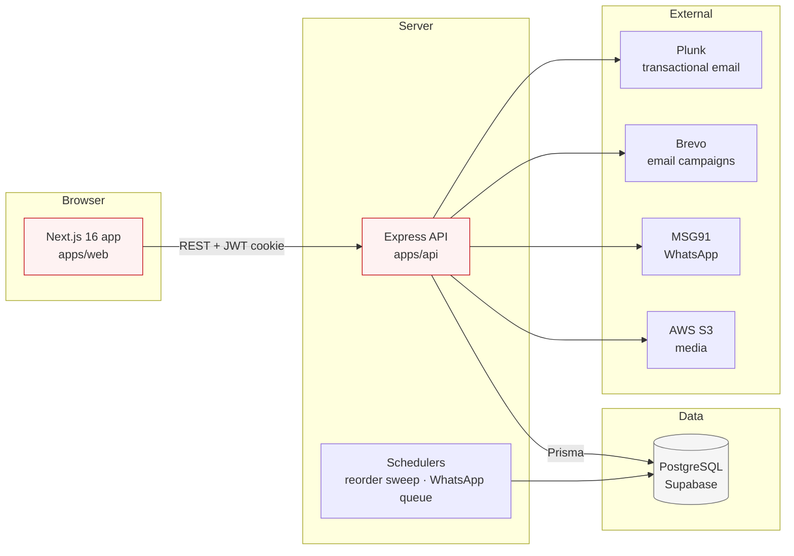

| Piece | Location | Responsibility |
|---|---|---|
| Web | `apps/web` | Next.js App Router UI. Holds no business rules; every mutation is an API call. |
| API | `apps/api` | Express + Prisma. Owns validation, authorisation, document numbering and stock maths. |
| Database | `packages/db` | Prisma schema, migrations and seeds. The single source of truth for shape. |
| UI kit | `packages/ui` | Shared components, design tokens and icons. |

---

## Repository layout

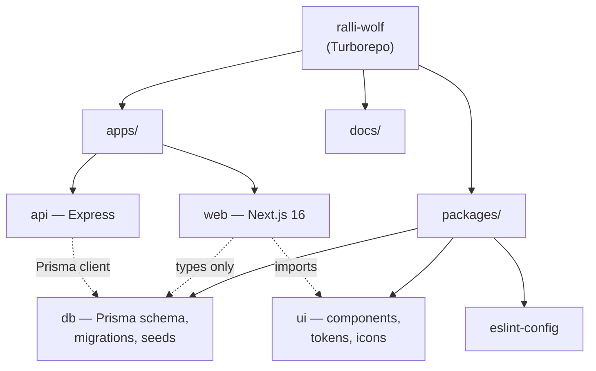

`packages/db` is imported by both apps, so a schema change ripples to both. Run
`pnpm --filter @repo/db prisma:generate` after editing the schema.

---

## How a request travels

Every screen follows the same path. Nothing bypasses the API.

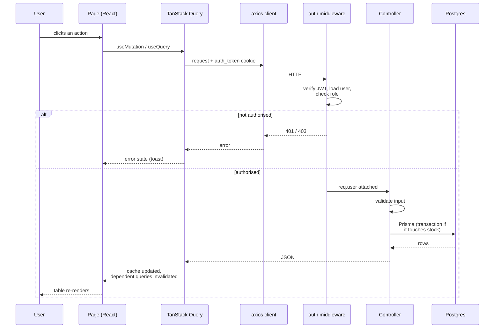

Two rules worth knowing:

- **Anything that moves stock runs in a transaction.** A goods receipt writes a
  lot, a balance and a movement together, or writes none of them.
- **Document numbers come from the database**, not the client. `NumberSequence`
  hands out `PO-2026-00601` and friends atomically, so two people submitting at
  once cannot collide.

---

## Authentication

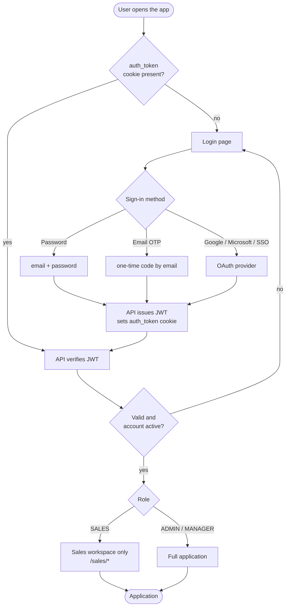

Roles live on `User.role`. `SalesRouteGuard` confines `SALES` users to
`/sales/*` plus a small allow-list; everything else is open to `ADMIN`.

---

## Module map

Which parts of the product depend on which. An arrow means "needs data from".

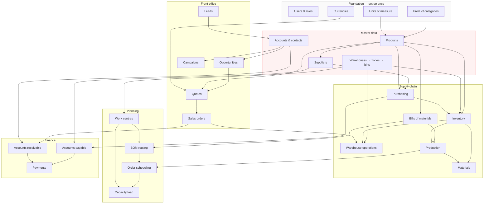

---

## Data model dependencies

This is the part that answers *"do I create a warehouse first, or inventory?"*

The arrows below are **required** foreign keys taken from
`packages/db/prisma/schema.prisma`. A required FK is a hard constraint: the
database will reject the child row if the parent does not exist. Optional
relations are omitted, because they impose no ordering.

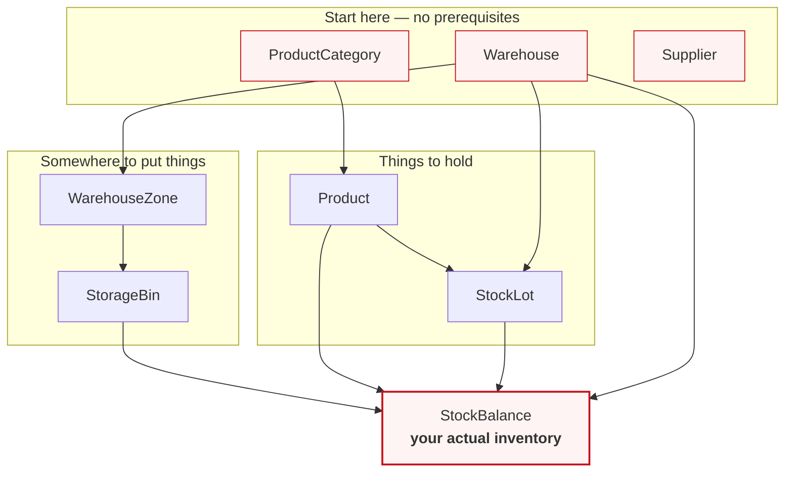

Everything else hangs off those same roots:

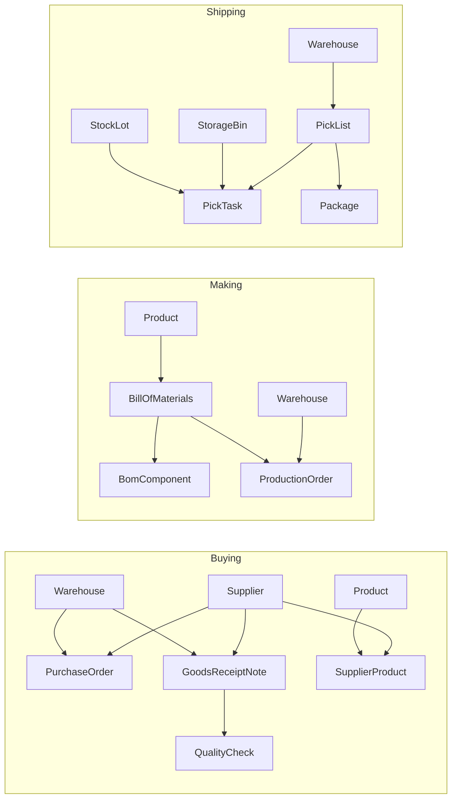

**The ordering this forces**, derived directly from the schema:

| # | Create | Because it requires |
|---|---|---|
| 1 | Warehouse | nothing |
| 2 | WarehouseZone | Warehouse |
| 3 | StorageBin | Warehouse **and** WarehouseZone |
| 4 | ProductCategory | nothing |
| 5 | Product | ProductCategory |
| 6 | Supplier | nothing |
| 7 | SupplierProduct | Supplier, Product |
| 8 | PurchaseOrder | Supplier, Warehouse |
| 9 | GoodsReceiptNote | Supplier, Warehouse |
| 10 | QualityCheck | GoodsReceiptNote |
| 11 | StockLot | Product, Warehouse |
| 12 | **StockBalance** | Product, Warehouse, **StorageBin**, StockLot |
| 13 | ReorderRule / StockAlert | Product, Warehouse |
| 14 | BillOfMaterials | Product |
| 15 | BomComponent | BillOfMaterials, Product |
| 16 | ProductionOrder | Product, BillOfMaterials, Warehouse |
| 17 | PickList | Warehouse |
| 18 | PickTask | PickList, Product, StockLot, StorageBin |

> **So: warehouse first, always.** Row 12 is the decisive one — a unit of stock
> is recorded as a `StockBalance`, which requires a `StorageBin`, which requires
> a `WarehouseZone`, which requires a `Warehouse`. There is no way to hold
> inventory before there is somewhere to put it.

---

## The supply-chain spine

The path a physical part takes, and the record written at each step.

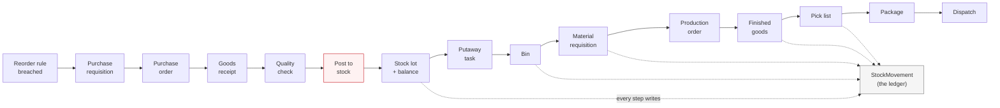

`StockMovement` is append-only and is the audit trail. Every quantity shown
anywhere in Inventory can be reconciled back to it.

---

## The money spine

Two mirrored halves. Buying creates an obligation to pay; selling creates a
right to collect. Both are settled the same way — by a `Payment` that is split
across one or more invoices through `PaymentAllocation`.

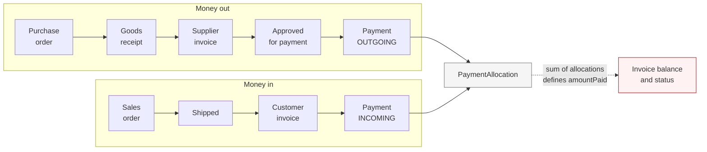

**The one rule that holds it together:** `amountPaid` is never written
directly. It is recomputed from the sum of that invoice's allocations, and the
status follows from the numbers — nothing paid is `APPROVED`, part is
`PARTIALLY_PAID`, all of it is `PAID`. This is why an invoice can never show a
balance its payments do not justify.

Three things the API refuses, each with a plain-language message:

| Attempt | Response |
|---|---|
| Allocating more than an invoice's outstanding balance | `400` — *"SINV-… has 62619.20 outstanding; cannot apply 99999.00."* |
| Settling a supplier invoice with an `INCOMING` payment | `400` — *"A supplier invoice can only be settled by an outgoing payment."* |
| Paying an invoice in a different currency | `400` — the currencies must match |

### Two payments, one balance

Checking an invoice's outstanding balance and then writing an allocation is a
read-modify-write, and it is not safe on its own. Two payments arriving at once
can both read 10,000 outstanding, both decide they fit, and both commit — and
the supplier has been paid twice.

Every invoice a payment touches is therefore locked with
`pg_advisory_xact_lock` **before any balance is read**, the same mechanism the
stock service uses for `stock_balances`. Locks are taken in a fixed order, so
two payments spanning the same pair of invoices cannot deadlock against each
other. Six concurrent full payments against one invoice resolve to exactly one
acceptance and five refusals.

### Money in different currencies is never added together

Adding 1000 USD to 1000 INR and calling the result 2000 is not a rounding
problem, it is a wrong number. So every total on the dashboard belongs to
exactly one currency:

- `payables` / `receivables` carry a `currencyCode` naming what their figures
  are in — the currency holding the most open invoices.
- `byCurrency` holds the same shape for every other currency on the book.
- `currencies` lists them all, so a mixed book can never be silently hidden.
- `netPosition` is `null` when the two sides are in different currencies,
  because there is nothing meaningful to subtract.

The UI states which currency a headline is in and names the others rather than
folding them in.

Ageing is computed from `dueDate` against today into five buckets — not due,
1–30, 31–60, 61–90, over 90 — per currency, and the dashboard shows both sides
together with the net position between them.

### Who can see it

Finance and planning are back-office functions, guarded exactly as the rest of
the supply chain is: `requireAuth` **and** `requireRole([ADMIN])`. What the
business owes, is owed, and is building is not readable by every account that
happens to be logged in — a `SALES` token gets `403` on every endpoint in both
modules.

---

## The planning spine

A bill of materials says *what* a product is made of. A routing says *how* it
gets made, and where. Scheduling turns that routing into dated work sitting on
real machines.

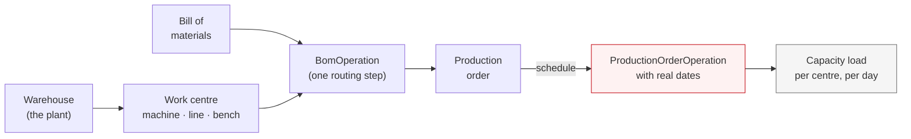

Two calculations carry the whole module.

**Effective capacity** — what a centre really gives you in a day:

```
capacityMinutesPerDay x (efficiencyPercent / 100) x parallelCapacity
```

A line rated 480 minutes, running at 90%, with four stations working side by
side, yields 1728 minutes — 28.8 hours a day.

**Operation duration** — what one step costs for a given batch:

```
setupMinutes + runMinutesPerUnit x quantity
```

Setup is paid once per run; the rest scales with the batch. Scheduling walks
the routing in sequence order, laying each step after the one before it. A step
marked `isBlocking` pushes the next one out; a non-blocking step does not, so
work that genuinely runs in parallel is modelled as such.

Rescheduling **replaces** an order's operations rather than appending to them,
and writes the order's own `plannedStartDate` / `plannedEndDate` back from the
first and last operation — so the board's dates can never contradict the plan
underneath them.

An order can only be scheduled if its BOM has a routing. The board says so
explicitly rather than failing silently.

---

## Background work

Two schedulers run inside the API process:

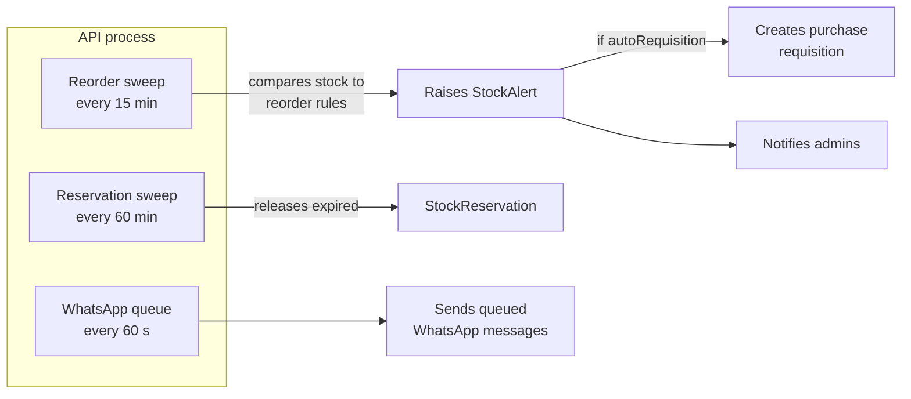

Intervals are overridable with `INVENTORY_ALERT_INTERVAL_MS` and
`WHATSAPP_SCHEDULER_INTERVAL_MS`.

---

## External services

| Service | Used for | Required env | Behaviour when absent |
|---|---|---|---|
| Plunk | Transactional email — password reset, account creation, approvals, notifications | `PLUNK_API_KEY`, `PLUNK_FROM_EMAIL` | Sends are skipped and logged; the app keeps working |
| Brevo | Email **campaigns** (`/campaigns/email`) | Brevo API key | **The page cannot load.** It reads campaigns from Brevo, not from the local database |
| MSG91 | WhatsApp templates and sending | Per-number credentials, stored AES-GCM encrypted | Templates cannot sync or send |
| AWS S3 | Campaign media and warehouse photos | `AWS_ACCESS_KEY_ID`, `AWS_SECRET_ACCESS_KEY`, `AWS_REGION` | Uploads fail |

Note the asymmetry: **WhatsApp campaigns are stored locally, email campaigns are
not.** `/campaigns/whatsapp` works from the database alone; `/campaigns/email`
is a view onto Brevo and needs that account configured.

---

## Related documents

- [USER_FLOWS.md](./USER_FLOWS.md) — every call to action, and the order to use them in
- [SUPPLY_CHAIN_MODULES.md](./SUPPLY_CHAIN_MODULES.md) — module reference and API endpoints
- [LOCAL_SETUP.md](./LOCAL_SETUP.md) — getting it running
