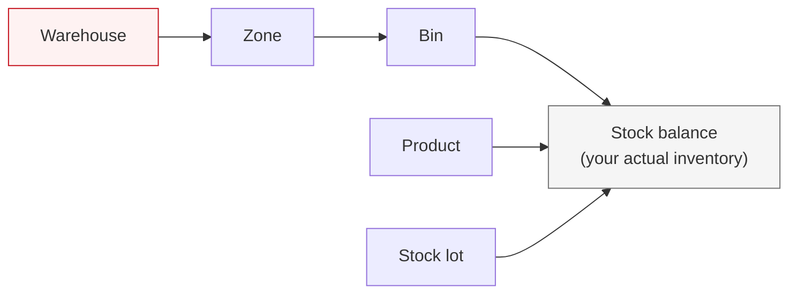
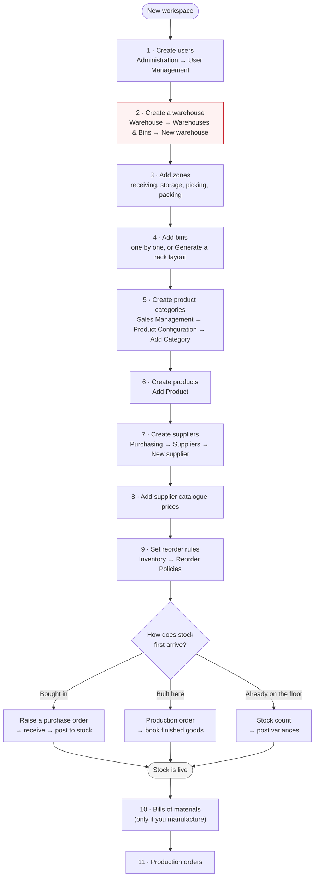
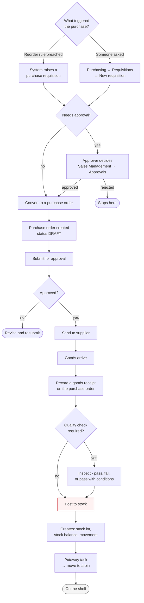
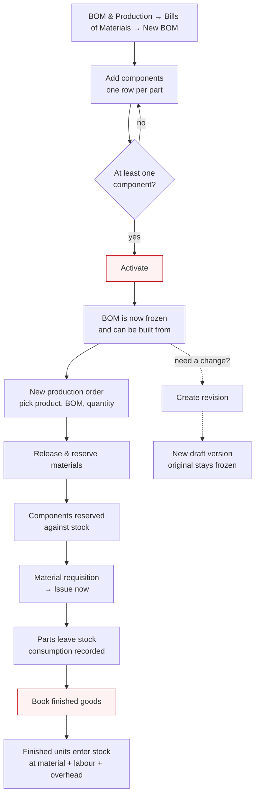
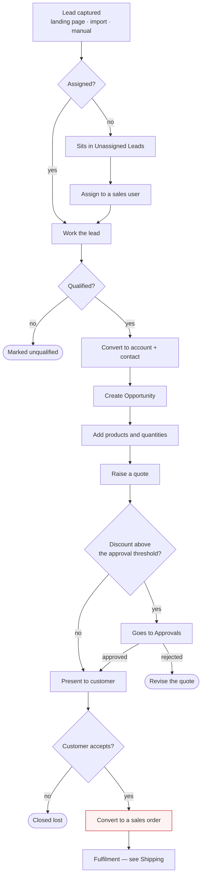
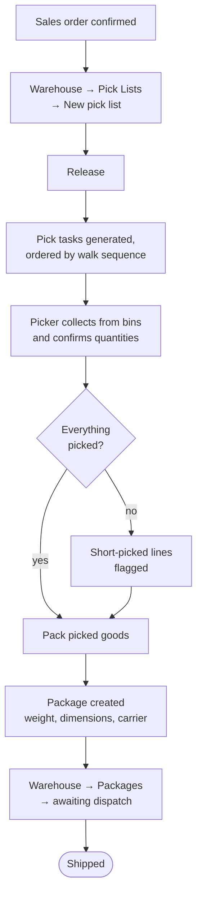
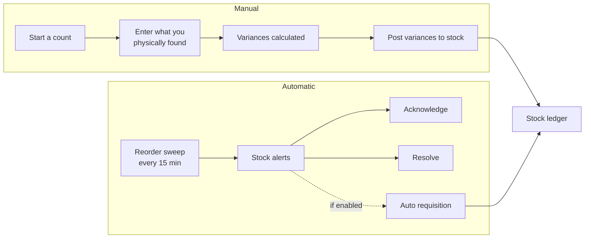
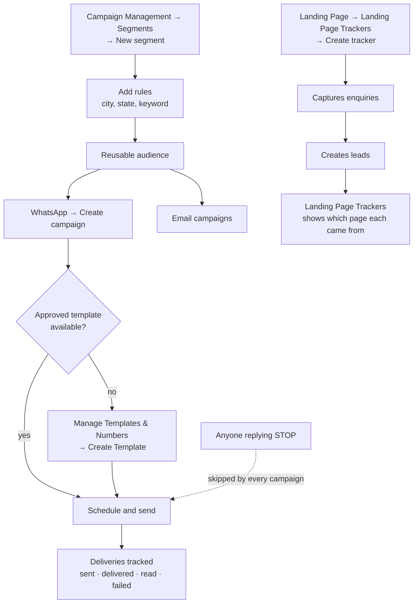

# User Flows and Call-to-Action Reference

What every button in Ralli Wolf Operations does, what has to exist before you
can press it, and the order to work through the application in.

If you only read one section, read [Where to start](#where-to-start) — it
answers the question most people ask first: *do I create a warehouse or
inventory?*

For how the system is built, see [ARCHITECTURE.md](./ARCHITECTURE.md).

---

## Contents

1. [Where to start](#where-to-start)
2. [Day-one setup, in order](#day-one-setup-in-order)
3. [Buying: requisition → order → receipt → stock](#buying)
4. [Making: BOM → production order → finished goods](#making)
5. [Selling: lead → opportunity → quote → order](#selling)
6. [Shipping: pick → pack → dispatch](#shipping)
7. [Keeping stock honest: counts, alerts, adjustments](#keeping-stock-honest)
8. [Marketing](#marketing)
9. [Complete call-to-action reference](#complete-call-to-action-reference)
10. [Things that will block you](#things-that-will-block-you)

---

## Where to start

**Create the warehouse first. Always.** Not inventory, not products, not
suppliers — the warehouse.

This is not a preference; the database enforces it. A quantity of stock is
stored as a `StockBalance` row, and that row cannot exist without a bin:

Every one of those arrows is a **required** foreign key. Try to record stock
before you have somewhere to put it and the database rejects it.

The short answer:

> **Warehouse → Zone → Bin → Product → then stock can exist.**

Nothing is pre-populated. A fresh workspace has no warehouses, so the first
thing anyone does is **Warehouse → Warehouses & Bins → New warehouse**.

---

## Day-one setup, in order

Steps 1–6 are mandatory for everyone. Steps 7–9 matter as soon as you buy
anything. Steps 10–11 only apply if you manufacture.

**There are exactly three ways stock can enter the system through the UI:**

1. **Buy it** — purchase order → goods receipt → *Post to stock*
2. **Build it** — production order → *Book finished goods*
3. **Count it in** — start a stock count, enter what is physically there, then
   *Post variances to stock*

Option 3 is how you load an opening balance for stock that already exists on the
floor. There is no "adjust stock" screen: the API has an adjustments endpoint
(`POST /api/inventory/adjustments`) but nothing in the interface calls it, so a
bulk opening load has to go through a count or through the API directly.

**Sales can be set up in parallel** — accounts, contacts and price books do not
depend on the warehouse. But you cannot *fulfil* an order without stock, so the
supply-chain side has to be real before you ship.

---

## Buying

From "we're running low" to "it's on the shelf".

**The important step is "Post to stock".** Until you press it, a goods receipt
is only paperwork — the quantities are recorded but your inventory has not
changed. This is deliberate: it gives you a window to count and inspect before
the numbers move.

---

## Making

Two things people trip over:

- **Activate is disabled until the BOM has at least one component.** The button
  is there, greyed, with a tooltip saying why.
- **An active BOM cannot be edited.** That is intentional — production orders
  reference it, and past jobs must stay reproducible. Use **Create revision**,
  which opens a new draft and leaves the original alone.

Before releasing a job, use **Materials → Build Availability** to check you
actually have the parts. It explodes the BOM, compares every component against
free stock, and tells you how many units you can build.

---

## Selling

The discount threshold is set in **Settings → Manager approval threshold**.
Anything above it routes to an approver before the quote can proceed.

---

## Shipping

You can only pack what has actually been picked — the pack step reads confirmed
pick quantities, not requested ones.

---

## Keeping stock honest

**Post variances to stock** is the committing step for a count — until then the
count sheet is just notes. Posting writes gain/loss movements so the correction
is auditable.

---

## Marketing

> **Email campaigns are different.** `/campaigns/email` reads from **Brevo**, an
> external service — not from this database. Without a Brevo API key configured
> that page cannot load. WhatsApp campaigns are stored locally and work on their
> own.

---

## Complete call-to-action reference

Every action button, what it does, and what must exist first.

### Administration

| Action | Where | What it does | Needs first |
|---|---|---|---|
| **Create User** | User Management | Adds a person and emails them credentials | — |
| **Notifications** (page) | Administration → Notifications | Choose which alerts you get, in-app and by email | — |

### Warehouse

| Action | Where | What it does | Needs first |
|---|---|---|---|
| **New warehouse** | Warehouse → Warehouses & Bins | Creates a site. **The first thing to do in a new workspace** | — |
| **Add a zone** | Warehouses & Bins → detail | Splits the site by function (receiving, storage, picking…) | A warehouse |
| **Add a single bin** | Warehouses & Bins → detail | Adds one storage location | A zone |
| **Generate a rack layout** | Warehouses & Bins → detail | Creates many bins at once with consistent aisle/rack/level codes and a walk order | A zone |
| **Add a pallet** | Warehouses & Bins → detail | Registers a pallet; leave the code blank to auto-number | A warehouse |
| **New pick list** | Pick Lists | Creates picking work for an order | Stock in bins |
| **Complete** (putaway) | Putaway Queue | Confirms stock moved into its destination bin | An open putaway task |

### Products and pricing

| Action | Where | What it does | Needs first |
|---|---|---|---|
| **Add Category** | Product Configuration | Groups products | — |
| **Add Product** | Product Configuration | Creates an item. Item type decides whether it can be bought, sold or built | A category |
| **View Categories** | Product Configuration | Manage the category list | — |
| Price book entries | Sales → Price Books | Sets what a customer is charged | Products |

### Purchasing

| Action | Where | What it does | Needs first |
|---|---|---|---|
| **New supplier** | Suppliers | Adds a vendor | — |
| **Add a contact** | Supplier → detail | Adds a person at that supplier | A supplier |
| **Add or supersede a price** | Supplier → detail | Records an agreed price; the previous one is retained as history | A supplier and product |
| **New requisition** | Purchasing → Requisitions | Asks to buy something, before a real order | A warehouse |
| **Convert to a purchase order** | Requisition → detail | Turns an approved request into a supplier order. Lines already ordered are excluded, so it cannot double-order | An approved requisition, a supplier |
| **New purchase order** | Purchase Orders | Orders directly from a supplier | A supplier and warehouse |
| **Submit for approval** | Purchase Order → detail | Sends the order to an approver | A draft order |
| **Record a goods receipt** | Purchase Order → detail | Records what physically arrived. **Does not change stock yet** | A sent order |
| **Post to stock** | Goods Receipt → detail | **Commits the receipt.** Creates lots, balances and movements | A receipt, and QC if required |

### Inventory

| Action | Where | What it does | Needs first |
|---|---|---|---|
| **Run reorder check** | Inventory | Re-evaluates every rule now instead of waiting for the sweep | Reorder rules |
| **Add / update policy** | Reorder Policies | Sets safety stock, reorder point and quantity for an item at a site | A product and warehouse |
| **Acknowledge** | Alerts | Marks an alert as seen without resolving it | An open alert |
| **Resolve** | Alerts | Closes an alert | An open alert |
| **Re-evaluate now** | Alerts | Recomputes alerts immediately | — |
| **Start a count** | Stock Counts | Opens a stock count sheet | A warehouse with stock |
| **Post variances to stock** | Count → detail | **Commits the count.** Writes gain/loss movements | A count with entered quantities |

### Materials and production

| Action | Where | What it does | Needs first |
|---|---|---|---|
| **Check availability** | Materials → Build Availability | Explodes a BOM and compares every component against free stock | An active BOM |
| **New requisition** | Materials → Requisitions | Asks the stores for parts | A warehouse |
| **Issue now** / **Issue everything outstanding** | Requisition → detail | Hands parts out and consumes them from stock | Stock on hand |
| **New BOM** | Bills of Materials | Starts a parts list for a product | A manufactured product |
| **Add** (component) | BOM → detail | Adds a part to the list. Loops are rejected | A draft BOM |
| **Add substitute** | BOM → detail | Approves an alternate part | A component row |
| **Activate** | BOM → detail | Freezes the BOM so it can be built from. **Disabled until it has ≥1 component** | A draft BOM with components |
| **Create revision** | BOM → detail | Opens a new draft; the active version stays frozen | An active BOM |
| **Retire** | BOM → detail | Marks an active BOM obsolete so it can no longer be built from | An active BOM |
| **New production order** | Production Orders | Plans a build | An active BOM |
| **Release & reserve materials** | Production → detail | Commits the job and reserves components | A planned order |
| **Book finished goods** | Production → detail | Records units produced and puts them into stock | A released order |

### Sales

| Action | Where | What it does | Needs first |
|---|---|---|---|
| **Add** / **Import** | Lead Management → Lead Master | Creates leads singly or from a file | — |
| **Export** | Most list pages | Downloads the current view | — |
| **Create Opportunity** | Opportunities | Starts a deal | An account |
| Raise a quote | Opportunity → detail | Prices the deal | An opportunity |
| **My approvals / All approvals** | Approvals | Switches between your queue and everything | — |
| Approve / Reject | Approval → detail | Decides a request. Nothing proceeds until you do | A pending approval |

### Marketing

| Action | Where | What it does | Needs first |
|---|---|---|---|
| **New segment** | Segments | Saves a reusable audience | Contacts or leads |
| **Preview** / **Edit** / **Delete** | Segments | Inspect or change an audience | A segment |
| **Create campaign** | WhatsApp | Starts a WhatsApp send | A segment, a number, an approved template |
| **Create Template** | Templates & Numbers | Submits a message layout for approval | A WhatsApp number |
| **Sync Templates** | Templates & Numbers | Pulls approval status from the provider | Configured credentials |
| **Add Opt-Out** | Opt-Outs | Manually suppresses a number | — |
| **Create tracker** | Landing Page → Landing Page Trackers | Creates a page that captures enquiries | — |

---

## Things that will block you

Common dead ends, and what they actually mean.

| Symptom | Cause | Fix |
|---|---|---|
| Cannot record any stock | No bins exist | Create warehouse → zone → bin first |
| **Activate** greyed out on a BOM | It has no components | Add at least one component |
| Cannot edit an active BOM | Active BOMs are frozen so past jobs stay reproducible | **Create revision** |
| Goods receipt saved but stock unchanged | The receipt has not been posted | Open it and **Post to stock** |
| Count entered but figures unchanged | Variances not posted | **Post variances to stock** |
| Shortage list is empty although stock looks low | Open purchase orders already cover the gap | Correct — a shortage only exists when safety stock exceeds on-hand *plus* what is on order |
| `/campaigns/email` stuck loading | It reads from Brevo, not this database, and no API key is configured | Configure Brevo, or use WhatsApp campaigns |
| A sales user lands on a 404 | `SALES` accounts are confined to `/sales/*` | Use an admin account, or add the path to the guard's allow-list |
| Prices show the wrong currency | The header currency picker is a **display** setting; it relabels, it does not convert | Pick the currency you want in the header |

---

## Related documents

- [ARCHITECTURE.md](./ARCHITECTURE.md) — system design and data-model dependencies
- [SUPPLY_CHAIN_MODULES.md](./SUPPLY_CHAIN_MODULES.md) — module reference and API endpoints
- [LOCAL_SETUP.md](./LOCAL_SETUP.md) — getting it running
